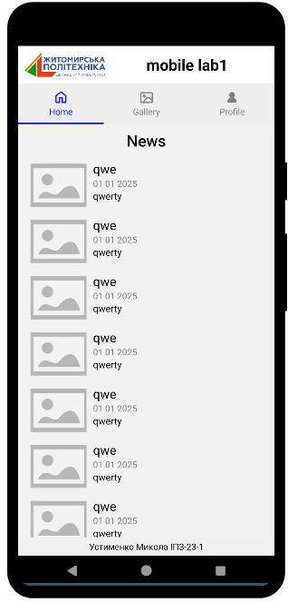
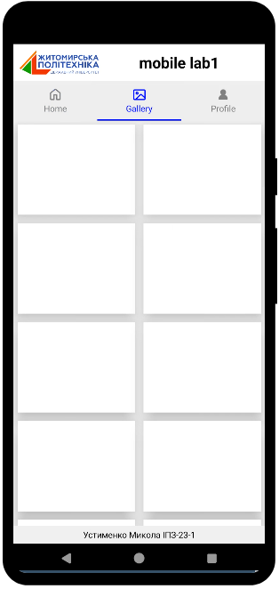
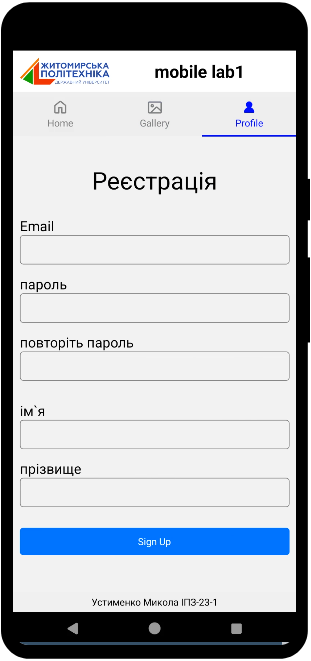

## Інструкція по запуску

1. Перейдіть за посиланням:
   👉 [Відкрити проєкт у Snack](https://snack.expo.dev/@mykola_ustymenko/lab1?platform=android)

2. Відкрити у мобільному додатку Expo Go (скануйте QR-код, який згенерує Snack).

---

## 🖼️ Скріншоти

  
  
  

