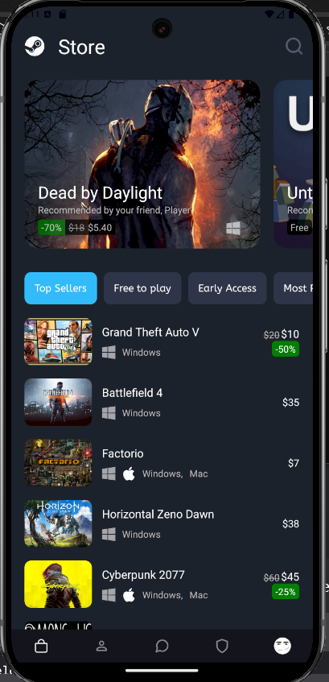
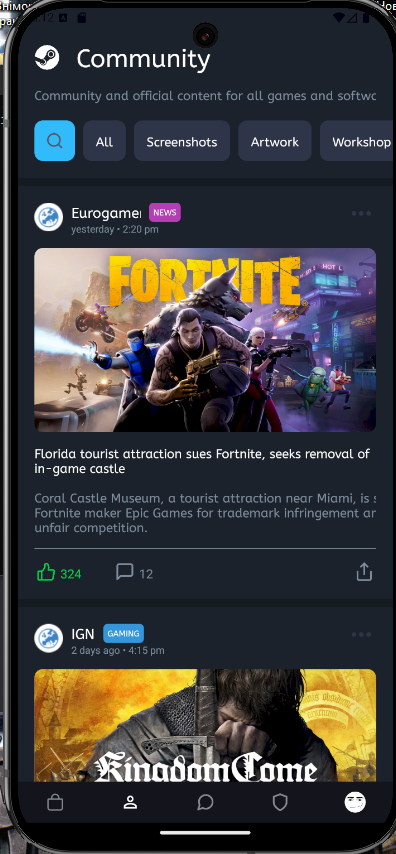
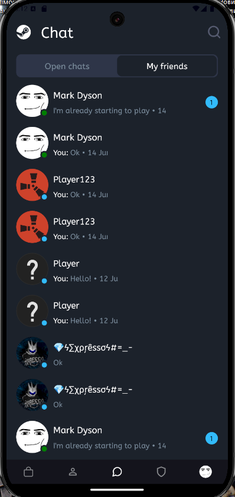
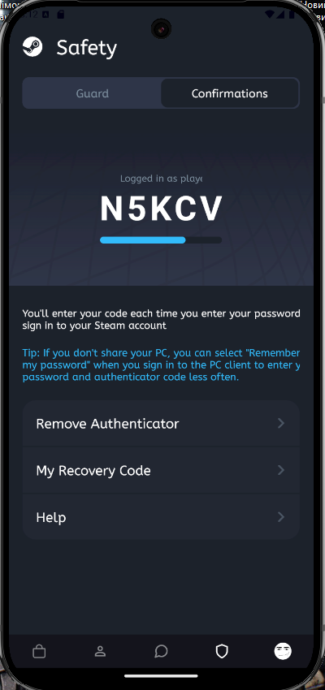
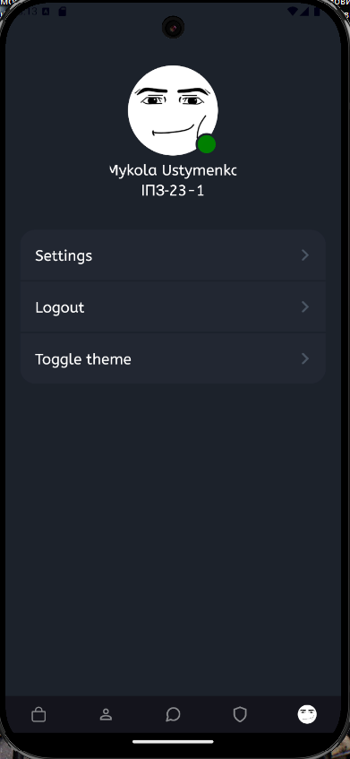

# Вимоги
- [Expo Go](https://play.google.com/store/apps/details?id=host.exp.exponent)
- [Node.js](https://nodejs.org/en)


## Інструкція по запуску

```bash
npx expo start --tunnel
```

Відскануйте QR на своєму пристрої

---

## Скріншоти

<div align="center">
  
  
  
  
  
</div>